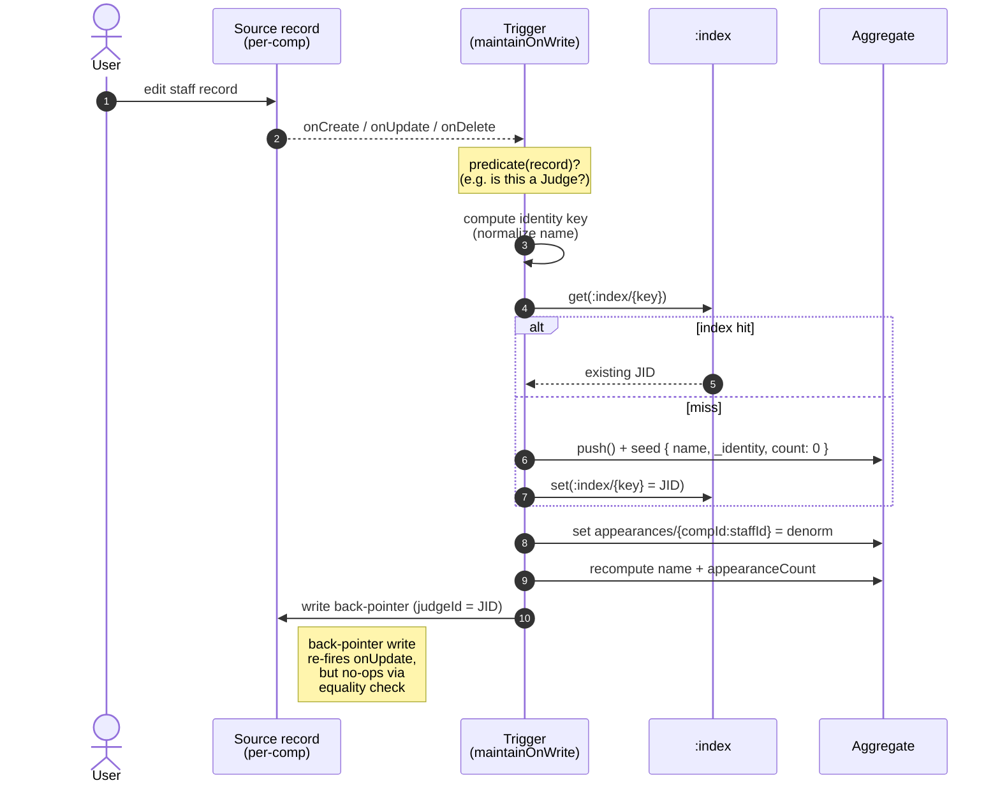
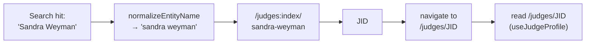

# Aggregators — how the first-class-entity system works

A plain-English tour of the trigger system that turns per-competition records
(judges, pipers, dancers, venues) into permanent, linkable entities with
their own profile pages.

For the *why*, see [ADR-0003](./adr/0003-first-class-entities.md). This doc is
the *how*.

---

## The problem

A real-world judge ("Sandra Weyman") might appear in 10 different competitions.
Today the database stores 10 independent staff records, one per comp. There's
no single "Sandra Weyman" entity, no permanent URL, no way to count her comps,
no place to attach a bio.

Same problem for pipers, dancers, and venues.

## The fix, in one sentence

For each entity kind, a Cloud Function watches the per-comp records and
maintains a **second copy** at the top level (`/judges/JID`) keyed by a stable
push-id — plus an **index** (`/judges:index/normalized-name → JID`) so the
frontend can resolve names to ids.

## Big picture

```mermaid
flowchart LR
    SRC["/competitions:data/&#123;comp&#125;/staff/&#123;staffId&#125;<br/>(source-of-truth, per-comp)"]
    TRG["Cloud Function trigger<br/>(judgeUpdated, etc.)"]
    AGG["/judges/&#123;JID&#125;<br/>(aggregate)"]
    IDX["/judges:index/&#123;name&#125; → JID<br/>(name lookup)"]
    PROF["Profile page<br/>/judges/&#123;JID&#125;"]
    SEARCH["Search hit<br/>(by name)"]

    SRC -- write fires --> TRG
    TRG -- upsert appearance --> AGG
    TRG -- name→id --> IDX
    TRG -- write back-pointer --> SRC

    SEARCH -- normalize&nbsp;name --> IDX
    IDX -- JID --> PROF
    PROF -- read --> AGG
```



## Data shapes

```
/competitions:data/{compId}/staff/{staffId}        ← source (truth)
  type:         'Judge' | 'Piper' | 'Other'
  firstName, lastName, image, location, ...
  judgeId:      'JID'   ← written by trigger (back-pointer)
  piperId:      'PID'   ← written by trigger if type='Piper'

/judges/{JID}                                       ← aggregate node
  name:              'Sandra Weyman'
  _identity:         'sandra weyman'    ← admin metadata (see footgun #3)
  appearanceCount:   5
  appearances:
    {compId}:{staffId}:
      firstName, lastName, image, bio, location, competitionId, staffId
    ...more...

/judges:index/{normalized-name} = '{JID}'           ← name → id lookup
```

Same shape for `/pipers`, `/dancers`. Venues are almost identical but with a
composite identity key — see the table below.

## Per-entity config

All four entities share one factory: `createAggregator()` in
[functions/src/utility/aggregate.ts](../functions/src/utility/aggregate.ts).
Each entity supplies a small config object — that's it.

| Entity | Source path | Trigger param | Predicate | Identity key |
|---|---|---|---|---|
| Judge | `staff/{staffId}` | `staffId` | `type === 'Judge'` | `normalize(name)` |
| Piper | `staff/{staffId}` | `staffId` | `type === 'Piper'` | `normalize(name)` |
| Dancer | `dancers/{dancerId}` | `dancerId` | always (`!!d`) | `normalize(name)` |
| Venue | `/competitions/{compId}` | *(none)* | comp has a `venue` | `normalize(name) + '|' + normalize(locality)` |

Venues are the odd one out: there's at most one venue per competition, so the
trigger fires on the comp meta itself (no sub-record id). And two same-named
venues in different cities shouldn't merge, hence the composite identity.

## Write path (the trigger)



### What happens on the four cases

| Trigger event | What `maintainOnWrite` does |
|---|---|
| `onCreate` (new matching record) | Find/create aggregate, link appearance, write back-pointer |
| `onUpdate`, no identity change | Re-link appearance (denorm may have changed), recompute |
| `onUpdate`, identity changed (e.g. rename to a different name) | Unlink from old aggregate, find/create new one, link there, update back-pointer |
| `onUpdate`, no longer matches predicate (e.g. type Judge → Other) | Unlink from old aggregate, clear back-pointer |
| `onDelete` | Unlink appearance from old aggregate |

When an aggregate's last appearance is removed, `recomputeAggregate` deletes
both the aggregate and its `:index` entry (using `_identity`).

## Read path (the frontend)

Two read modes:

**a) From a search result (have a name, need a profile):**



**b) From a direct URL (have an id, render the profile):**

The profile composable (`useJudgeProfile`, `usePiperProfile`, etc.) reads
`/{namespace}/{id}` once, then fetches comp metadata for each appearance via
the cached `fetchCompetitionMeta`. Image, bio, location are resolved
client-side from "latest-non-null appearance after sorting by comp date desc."

> Why client-side? The trigger doesn't have to know about display rules.
> The aggregate is just the raw appearances; the UI decides how to summarize.

## Backfill

Admins can re-run a backfill from `Admin → Info → Aggregators`. Each per-entity
button calls `backfill{Entity}Aggregates`, which:

1. Wipes `/{namespace}` and `/{namespace}:index`.
2. Loops every competition.
3. For each source record that passes the predicate, creates / fetches the
   aggregate, writes its appearance, recomputes.

The backfill is idempotent. It does **not** write back-pointers on source
records — that would cause a trigger storm (one onUpdate per source record ×
thousands of records). The back-pointer gets populated whenever the source
record is next edited; reverse lookups via `:index` keep working in the
meantime.

## Important invariants & footguns

1. **The two `normalizeName` functions MUST stay in sync.** They live in
   [functions/src/utility/normalize.ts](../functions/src/utility/normalize.ts)
   and [web/src/lib/entityIndex.ts](../web/src/lib/entityIndex.ts) and there
   is no shared code between the two packages. If either drifts, lookups
   silently miss and profile pages 404.

2. **Identity keys can't contain RTDB's reserved characters** (`. $ # [ ] /`).
   Normalization strips punctuation to whitespace, which protects against this.

3. **The `_identity` field on aggregates is admin metadata** (used by the
   delete path to know which `:index` entry to remove). It's not a display
   field — don't render it.

4. **Back-pointer loop avoidance** relies on the equality check in
   `setBackPointer` and the no-op when `oldKey === newKey`. Don't strip
   either.

5. **Backfill races with live writes.** If someone edits a record mid-rebuild,
   the result can be slightly inconsistent. Pick a quiet time, or accept
   the next live edit will reconcile.

6. **Profile composables resolve display fields by "latest-non-null."** A
   stale appearance with an old image will still win if it has the most recent
   comp date. Admin merge/split tooling is the future fix.

## Files at a glance

```
functions/src/
  utility/
    aggregate.ts       ← the factory; ~270 lines, single source of truth
    normalize.ts       ← name normalization (mirror of web/.../entityIndex.ts)
  dancers.ts           ← Typesense glue + aggregator config for dancers
  judges.ts            ← Typesense glue + aggregator config for judges
  pipers.ts            ← Typesense glue + aggregator config for pipers
  venues.ts            ← aggregator config for venues (no Typesense yet)
  index.ts             ← wires trigger refs to the handlers

web/src/
  lib/entityIndex.ts   ← lookupEntityId() + the mirror normalize function
  composables/
    useJudgeProfile.ts, usePiperProfile.ts,
    useDancerProfile.ts, useVenueProfile.ts
  components/
    EntityLayout.vue   ← shared profile shell
    EntityIndex.vue    ← shared list page
```
